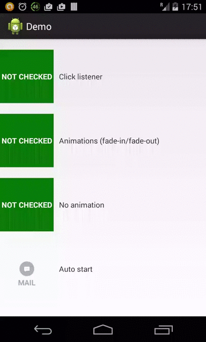

FlipView
========
Android custom state View Group - FlipView UI library

[](https://www.apache.org/licenses/LICENSE-2.0) [](https://android-arsenal.com/details/1/1073)


ABOUT
------
If you have a need to have a UI component which will act similar to toggle button or be like a view group with state checked/unchecked this is a right place for you.





GRADLE
------

```xml
dependencies {
    compile 'com.github.polok.flipview:library:1.0.0'
}
```

Customization
------

```xml

   <!-- FlipView front view layout resource -->
   app:flip_view_front_layout="" [format="reference"]

   <!-- FlipView back view layout resource -->
   app:flip_view_back_layout="" [format="reference"]

   <!-- Is FlipView checked or not by default-->
   app:is_checked="" [format="boolean"] (default:false)

   <!-- Is FlipView animated when changing status -->
   app:"show_animations="" [format="boolean"] (default:false)

   <!-- FlipView animation to apply when state goes from "not checked" to "checked" -->
   app:fade_in_animation="" [format="reference"]

   <!-- FlipView animation to apply when state goes from "checked" to "not checked" -->
   app:fade_out_animation="" [format="reference"]

   <!-- FlipView animation duration -->
   app:animation_duration="" [format="integer"] (default:100ms)
```

USAGE
------

```xml
    <com.github.polok.flipview.FlipView
        android:id="@+id/flip_animation_view_demo"
        android:layout_width="100dp"
        android:layout_height="100dp"
        android:descendantFocusability="blocksDescendants"
        app:is_checked="true"
        app:flip_view_front_layout="@layout/flip_text_view_front_layout"
        app:flip_view_back_layout="@layout/flip_text_view_back_layout"
        app:show_animations="false" />
```

```java
((FlipView)findViewById(R.id.flip_animation_view_demo)).setFlipViewChangeListener(new FlipView.FlipViewChangeListener() {
            @Override
            public void onFlipViewClick(FlipView flipView, boolean isChecked) {
                Toast.makeText(MainActivity.this, "Clicked - " + isChecked, Toast.LENGTH_SHORT).show();
            }
        });
```

API
------

```java
    public static interface FlipViewChangeListener {
        void onFlipViewClick(FlipView flipView, boolean isChecked);
    }
```

Developed By
------------
Marcin Polak - mpolak87(at).gmail.com

License
----------

```
Copyright 2014 Marcin Polak

Licensed under the Apache License, Version 2.0 (the "License");
you may not use this file except in compliance with the License.
You may obtain a copy of the License at

http://www.apache.org/licenses/LICENSE-2.0

Unless required by applicable law or agreed to in writing, software
distributed under the License is distributed on an "AS IS" BASIS,
WITHOUT WARRANTIES OR CONDITIONS OF ANY KIND, either express or implied.
See the License for the specific language governing permissions and
limitations under the License.
```
